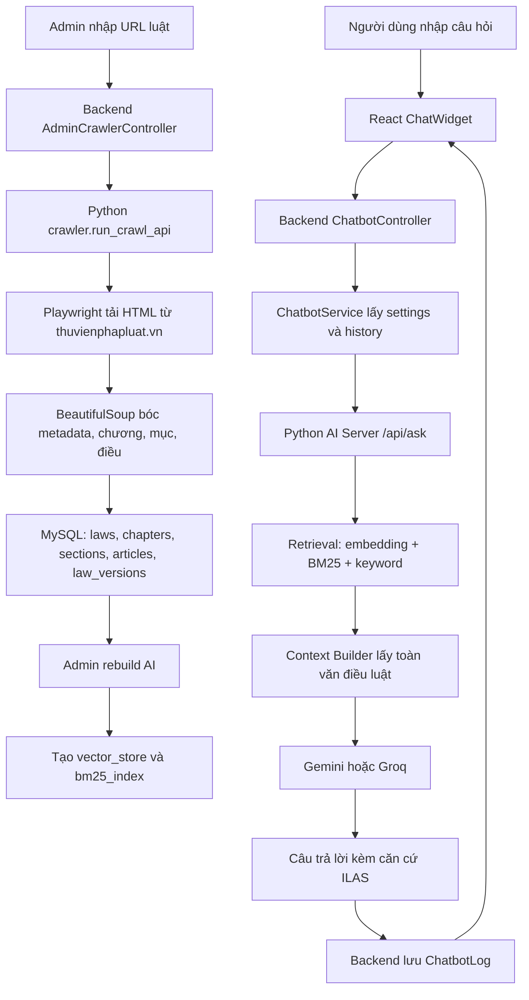

# PROJECT_EXPLANATION - Giải thích dự án ILAS

Tài liệu này được viết dựa trên source code hiện tại của project ILAS. Trọng tâm là hai phần quan trọng nhất khi bảo vệ: phần cào dữ liệu pháp luật và phần AI xử lý câu hỏi theo hướng RAG.

## 1. Tổng quan dự án

ILAS là viết tắt của Intelligent Legal Assistant System. Đây là một hệ thống web hỗ trợ tra cứu và hỏi đáp pháp luật, đặc biệt hướng tới các vấn đề pháp lý thường gặp của người lao động như hợp đồng lao động, nghỉ phép, trợ cấp, bảo hiểm, chấm dứt hợp đồng.

Người dùng cuối của hệ thống gồm:

- Người lao động hoặc người dân cần hỏi nhanh các vấn đề pháp lý.
- Quản trị viên, có quyền cào dữ liệu luật, cấu hình chatbot, xem thống kê và log.
- Moderator, có quyền quản lý nội dung luật, điều luật và bản giải thích đơn giản.

Vấn đề dự án giải quyết là: văn bản pháp luật thường dài, khó đọc, khó tìm đúng điều khoản. Nếu người dùng chỉ tìm kiếm bằng từ khóa thông thường, họ phải tự đọc rất nhiều kết quả. ILAS cố gắng thu thập dữ liệu luật vào cơ sở dữ liệu, tạo chỉ mục tìm kiếm, sau đó dùng AI để trả lời bằng ngôn ngữ dễ hiểu nhưng vẫn dựa trên điều luật gốc.

Luồng hoạt động tổng quát:

1. Admin cào dữ liệu luật từ `thuvienphapluat.vn` và lưu vào MySQL.
2. Admin chạy rebuild AI để tạo vector store và BM25 index từ dữ liệu luật.
3. Người dùng nhập câu hỏi ở chatbot trên frontend.
4. Frontend gửi câu hỏi tới backend Spring Boot.
5. Backend chuyển câu hỏi, settings và lịch sử hội thoại sang Python AI server.
6. Python AI server tìm các điều luật liên quan bằng semantic search, lexical search và BM25.
7. Hệ thống lấy lại toàn văn điều luật liên quan từ MySQL hoặc fallback từ vector store.
8. AI Gemini hoặc Groq nhận câu hỏi + ngữ cảnh luật và sinh câu trả lời.
9. Backend lưu log hội thoại rồi trả kết quả về frontend.

## 2. Kiến trúc hệ thống

Project hiện tại chia thành ba khối chính:

- `frontend`: giao diện React, gồm trang người dùng, admin, moderator và chatbot.
- `backend`: Spring Boot API, quản lý user, JWT, luật, form, feedback, crawler endpoint, chatbot endpoint.
- `python`: crawler, AI server Flask, RAG pipeline, vector store và BM25 index.

Các file quan trọng:

- `docker-compose.yml`: định nghĩa MySQL, AI server Python, backend và frontend.
- `backend/src/main/resources/application.properties`: cấu hình database, JWT, API key, crawler Python.
- `backend/src/main/java/com/C1SE10/backend/controller/admin/AdminCrawlerController.java`: API admin để chạy crawler Python từ backend.
- `backend/src/main/java/com/C1SE10/backend/controller/admin/AdminAIController.java`: API rebuild AI, start/stop AI server khi chạy local.
- `backend/src/main/java/com/C1SE10/backend/controller/ai/ChatbotController.java`: API chatbot cho user và admin.
- `backend/src/main/java/com/C1SE10/backend/service/ai/ChatbotService.java`: gọi Python AI server, lấy settings, lưu log chatbot.
- `python/crawler/crawl_law.py`: file chính cào luật từ Thư viện Pháp luật.
- `python/crawler/metadata_extractor.py`: bóc tiêu đề, số hiệu, loại văn bản, ngày ban hành, ngày hiệu lực.
- `python/crawler/content_cleaner.py`: làm sạch nội dung điều luật.
- `python/crawler/db_inserts.py`: insert chương, mục, điều vào MySQL.
- `python/ai/app.py`: Flask AI server, expose `/api/ask` và `/api/admin/rebuild`.
- `python/ai/legal_rag_pipeline.py`: pipeline RAG chính để trả lời câu hỏi.
- `python/ai/retrieval_level6.py`: tìm kiếm nhiều nguồn bằng embedding, BM25, keyword và ranking.
- `python/ai/context_builder.py`: lấy toàn văn điều luật từ DB để đưa vào AI.
- `python/ai/local_embedder.py`: tạo embedding bằng Sentence Transformers.
- `python/ai/build_vector_store_articles.py`: tạo vector cho toàn bộ điều luật.
- `python/ai/build_vector_store_chunks.py`: tách điều luật thành chunk/khoản/điểm và tạo vector.
- `python/ai/build_vector_store_simplified.py`: tạo vector cho nội dung luật đã được đơn giản hóa.
- `python/ai/bm25_index.py`: tạo và tìm kiếm BM25 index.

Sơ đồ luồng xử lý:

## 3. Phần cào luật / thu thập dữ liệu

Dữ liệu luật hiện tại được lấy từ website `https://thuvienphapluat.vn/van-ban/...`. Điều này thể hiện ở cả backend và Python crawler: URL phải bắt đầu bằng `https://thuvienphapluat.vn/van-ban/`, nếu không hệ thống từ chối.

Quy trình cào dữ liệu nằm chính trong `python/crawler/crawl_law.py`:

1. Nhận URL từ command line hoặc từ backend.
2. Dùng Playwright mở Chromium ở chế độ headless để tải HTML.
3. Đợi trang render xong, lấy `page.content()`.
4. Dùng BeautifulSoup đọc HTML.
5. Gọi `extract_metadata` để lấy thông tin văn bản.
6. Kiểm tra trang có anchor điều luật dạng `a[name^='dieu_']`.
7. Lưu hoặc cập nhật bản ghi trong bảng `laws`.
8. Tăng `version_number` nếu luật đã tồn tại cùng mã số.
9. Archive dữ liệu chương/mục/điều cũ của luật đó.
10. Duyệt các thẻ `p` trong `div#ctl00_Content_ThongTinVB_pnlDocContent`.
11. Nhận diện chương theo anchor `chuong_`, mục theo `muc_`, điều theo `dieu_`.
12. Lưu dữ liệu vào các bảng `chapters`, `sections`, `articles`.
13. Dọn bớt version cũ, mặc định giữ 5 version mới nhất mỗi luật.

Các file chịu trách nhiệm:

- `python/crawler/run_crawl.py`: chạy crawler thủ công bằng terminal, nhập URL.
- `python/crawler/run_crawl_api.py`: chạy crawler theo tham số URL, phục vụ backend gọi bằng `python -m crawler.run_crawl_api <url>`.
- `python/crawler/crawl_law.py`: logic crawl chính.
- `python/crawler/metadata_extractor.py`: trích xuất metadata.
- `python/crawler/content_cleaner.py`: chuẩn hóa nội dung điều luật.
- `python/crawler/db_inserts.py`: ghi chương, mục, điều.
- `python/crawler/archive_cleanup.py`: archive dữ liệu cũ và cleanup version.
- `backend/.../AdminCrawlerController.java`: API `/api/admin/crawler/laws` để admin chạy crawler từ giao diện.
- `frontend/src/pages/admin/CrawlLaws.jsx`: giao diện nhập URL, xem log và summary sau khi crawl.

Dữ liệu sau khi cào gồm:

- Trong bảng `laws`: `title`, `code`, `law_type`, `issued_date`, `effective_date`, `source_url`, `status`, `version_number`, `last_crawled_at`.
- Trong bảng `law_versions`: `law_id`, `version_number`, `title`, `law_type`, `issued_date`, `effective_date`, `source_url`, `status`.
- Trong bảng `chapters`: số chương, tiêu đề chương, version, status.
- Trong bảng `sections`: số mục, tiêu đề mục, version, status.
- Trong bảng `articles`: số điều, tiêu đề điều, nội dung điều, quan hệ tới luật/chương/mục, version, status.

Cách làm sạch và chuẩn hóa:

- Metadata ngày tháng được chuẩn hóa về dạng `YYYY-MM-DD` trong `safe_date`.
- Số hiệu văn bản được xóa khoảng trắng và chuyển uppercase.
- Tiêu đề được so sánh bằng hàm bỏ dấu, lower-case và tính độ giống nhau để tránh ghi đè nhầm luật có cùng code nhưng tiêu đề quá khác.
- Nội dung điều luật được xử lý bởi `normalize_article_content`: gộp dòng HTML bị vỡ, giữ xuống dòng cho các phần như `1.`, `a)`, `-`, `•`.
- Khi insert vào DB, một số trường được cắt độ dài bằng `_truncate` để tránh vượt giới hạn cột.

Vì sao cần bước cào luật:

- AI không nên trả lời pháp luật chỉ bằng kiến thức có sẵn của mô hình.
- Dữ liệu luật cần được lưu có cấu trúc để tìm kiếm, trích dẫn và kiểm chứng.
- Khi có DB luật, hệ thống có thể tạo embedding, BM25 index và lấy lại đúng điều luật làm ngữ cảnh cho AI.
- Crawler giúp cập nhật lại dữ liệu khi văn bản nguồn thay đổi.

Rủi ro khi cào dữ liệu và cách xử lý hiện tại:

- Thiếu dữ liệu: nếu trang không có anchor `dieu_`, crawler báo lỗi thay vì ghi dữ liệu sai.
- Sai định dạng metadata: `metadata_extractor.py` có fallback lấy số hiệu và ngày từ tiêu đề hoặc nội dung in nghiêng, nhưng vẫn có thể thiếu nếu trang quá khác.
- Website thay đổi cấu trúc: crawler đang phụ thuộc selector `table.table-info`, `div#ctl00_Content_ThongTinVB_divThongTin` và `div#ctl00_Content_ThongTinVB_pnlDocContent p`; nếu website đổi HTML thì cần cập nhật selector.
- Dữ liệu trùng lặp: crawler kiểm tra `code`, cập nhật version thay vì tạo luật mới; dữ liệu cũ của cùng luật được archive.
- Ghi đè nhầm: code có kiểm tra độ giống tiêu đề, nếu quá thấp thì raise lỗi.
- Version quá nhiều: `cleanup_versions` giữ 5 version mới nhất mỗi luật và xóa phần quá cũ theo thứ tự tránh lỗi khóa ngoại.

Hướng cải thiện:

- Thêm bộ test với HTML mẫu để phát hiện sớm khi website đổi cấu trúc.
- Lưu snapshot HTML hoặc snapshot JSON đầy đủ cho mỗi lần crawl để audit.
- Có cơ chế deduplicate sâu hơn theo `source_url`, `code`, `article_number` và hash nội dung.
- Sau khi crawl thành công nên tự động kích hoạt rebuild vector/BM25 hoặc cảnh báo admin cần rebuild.
- Ghi log crawl vào database thay vì chỉ trả log qua stdout/API.

## 4. Phần AI của dự án

AI trong ILAS dùng để trả lời câu hỏi pháp lý bằng ngôn ngữ dễ hiểu, dựa trên các điều luật đã được lưu trong hệ thống. AI không tự tìm kiếm web trực tiếp khi trả lời; nó nhận ngữ cảnh luật do pipeline retrieval cung cấp.

Project có dùng:

- Mô hình ngôn ngữ: Gemini mặc định, Groq nếu `AI_PROVIDER=groq` hoặc fallback khi Gemini lỗi.
- Embedding: Sentence Transformers trong `python/ai/local_embedder.py`, mặc định `intfloat/multilingual-e5-small`.
- Tìm kiếm ngữ nghĩa: cosine similarity giữa embedding câu hỏi và embedding điều luật/chunk.
- BM25: tìm kiếm từ khóa truyền thống trong `python/ai/bm25_index.py`.
- Vector store dạng file local: `python/vector_store/.../vectors.npy` và `meta.json`, chưa dùng một vector database server riêng như Pinecone, Qdrant hoặc Milvus.

Cách biến dữ liệu luật thành dạng AI có thể tìm kiếm:

1. Dữ liệu luật nằm trong MySQL, chủ yếu bảng `articles`.
2. `build_vector_store_articles.py` lấy các điều luật active, embed toàn bộ nội dung điều luật, lưu vào `vector_store/articles`.
3. `build_vector_store_chunks.py` tách nội dung điều luật thành chunk theo khoản/điểm như `1.`, `a)`, `đ)`, embed từng chunk, lưu vào `vector_store/articles/chunks`.
4. `build_vector_store_simplified.py` lấy nội dung đã đơn giản hóa từ `simplified_articles` có status `approved`, embed và lưu vào `vector_store/simplified`.
5. `bm25_index.py` đọc các `meta.json`, tokenize đơn giản bằng split khoảng trắng, tạo file `.pkl` trong `python/bm25_index`.
6. `rebuild_all.py` chạy toàn bộ các bước trên và build topic clusters.

Quy trình khi người dùng đặt câu hỏi:

1. Frontend `ChatWidget.jsx` gọi `sendChatMessage`.
2. `frontend/src/api/chatbotAPI.js` POST tới `/api/chatbot/ask`.
3. `ChatbotController` chuyển request cho `ChatbotService`.
4. `ChatbotService` lấy `ChatbotSettings`, lấy lịch sử hội thoại theo `conversationId`, rồi gọi Python AI server.
5. `python/ai/app.py` nhận request tại `/api/ask`.
6. `legal_rag_pipeline.py` kiểm tra settings, có thể rewrite câu hỏi nếu là câu hỏi follow-up mơ hồ.
7. Câu hỏi được mở rộng thêm một số cụm từ pháp lý phổ biến, ví dụ câu liên quan nghỉ sinh, ly hôn, đất đai.
8. `retrieve_multi_source` tìm văn bản liên quan bằng semantic search, article-level lexical search và BM25 fallback.
9. `context_builder.py` lấy toàn văn tối đa 4 điều luật liên quan, giới hạn tổng context khoảng 6500 ký tự.
10. Gemini hoặc Groq nhận prompt gồm câu hỏi và `NGỮ CẢNH PHÁP LUẬT`.
11. AI trả lời, pipeline nối thêm phần `Căn cứ ILAS đã dùng`.
12. Backend lưu `ChatbotLog` nếu `saveLog=true`.

RAG là gì?

RAG là Retrieval-Augmented Generation, nghĩa là trước khi cho AI sinh câu trả lời, hệ thống sẽ truy xuất dữ liệu liên quan từ kho tri thức riêng. AI không trả lời hoàn toàn bằng trí nhớ của mô hình, mà trả lời dựa trên đoạn luật được hệ thống tìm thấy. Trong ILAS, kho tri thức là dữ liệu luật đã crawl và lưu trong MySQL/vector store.

ILAS áp dụng RAG như sau:

- Retrieval: tìm điều luật/chunk liên quan từ `vector_store` và `bm25_index`.
- Augmentation: lấy toàn văn điều luật từ MySQL bằng `context_builder.py`.
- Generation: đưa context vào Gemini/Groq để sinh câu trả lời.
- Grounding: prompt bắt AI chỉ dùng phần `NGỮ CẢNH PHÁP LUẬT` và mỗi kết luận phải gắn căn cứ điều luật.

Vai trò của vector database/vector store:

- Project hiện tại dùng vector store local bằng file `.npy` và `meta.json`, không phải vector database server.
- Vector store giúp lưu embedding của điều luật để so sánh ngữ nghĩa với câu hỏi.
- Ví dụ người dùng hỏi "sếp cho nghỉ ngang có được không", hệ thống có thể tìm tới các điều về "người sử dụng lao động đơn phương chấm dứt hợp đồng" dù câu hỏi không dùng đúng thuật ngữ pháp lý.

Ưu điểm của AI trong tra cứu luật:

- Người dùng hỏi bằng ngôn ngữ tự nhiên, không cần biết chính xác số điều.
- AI diễn giải điều luật khô khan thành câu trả lời dễ hiểu.
- RAG giúp câu trả lời có căn cứ từ dữ liệu ILAS.
- Có thể dùng lịch sử hội thoại để hiểu câu hỏi tiếp theo như "khoản đó nghĩa là gì?".

Hạn chế:

- AI vẫn có thể trả lời sai nếu retrieval lấy nhầm điều luật hoặc context thiếu.
- Câu trả lời phụ thuộc dữ liệu đã crawl và đã rebuild vector/BM25.
- Nếu DB rỗng hoặc vector store cũ, AI có thể không tìm được căn cứ đúng.
- Prompt đã yêu cầu không bịa, nhưng vẫn cần người dùng kiểm chứng với văn bản gốc.
- Hiện tại backend `ChatbotService` đang hardcode Python API là `http://127.0.0.1:5000/api/ask`; trong môi trường Docker tách container, hướng tốt hơn là đọc từ biến cấu hình như `PYTHON_AI_URL`.

## 5. Luồng xử lý chi tiết với ví dụ

Câu hỏi ví dụ: "Quy định về nghỉ phép năm của người lao động là gì?"

Các bước hệ thống xử lý:

1. Người dùng nhập câu hỏi trong chatbot.
2. `ChatWidget.jsx` gửi request gồm `userId`, `question`, `saveLog`, `conversationId`.
3. Backend nhận tại `/api/chatbot/ask`.
4. `ChatbotService` đọc settings chatbot như `enabled`, `dataSource`, `temperature`, `maxTokens`.
5. Nếu chatbot đang tắt, backend trả thông báo tạm dừng. Nếu đang bật, backend gọi Python AI server.
6. Python nhận câu hỏi ở `/api/ask`.
7. `legal_rag_pipeline.py` kiểm tra câu hỏi. Vì câu hỏi đã có từ pháp lý rõ như "nghỉ phép năm", hệ thống thường không cần rewrite bằng AI.
8. Query có thể được giữ nguyên hoặc mở rộng nếu khớp rule trong code.
9. `retrieve_multi_source` tạo embedding cho câu hỏi bằng Sentence Transformers.
10. Hệ thống so sánh embedding câu hỏi với vector của điều luật/chunk.
11. Hệ thống cũng chạy tìm kiếm lexical/article-level và có thể dùng BM25 nếu kết quả semantic yếu.
12. Các kết quả được rank theo semantic score, BM25 score, độ trùng từ khóa, độ trùng tiêu đề, topic boost và ưu tiên nguồn.
13. Kết quả phù hợp có khả năng là các điều trong Bộ luật Lao động liên quan đến nghỉ hằng năm.
14. `context_builder.py` lấy toàn văn điều luật từ bảng `articles`, kèm tên luật từ bảng `laws`.
15. Context được đưa vào Gemini/Groq với system prompt yêu cầu chỉ trả lời dựa trên context.
16. AI trả lời bằng tiếng Việt dễ hiểu, ví dụ nêu số ngày nghỉ hằng năm nếu điều luật liên quan có trong context, và gắn căn cứ như "theo Điều ...".
17. Pipeline thêm danh sách `Căn cứ ILAS đã dùng`.
18. Backend nhận câu trả lời, lưu vào `chatbot_logs`, rồi trả về frontend.
19. Frontend hiển thị câu trả lời Markdown cho người dùng.

Nếu dữ liệu về nghỉ phép năm chưa có trong DB hoặc vector store chưa được rebuild sau khi crawl, hệ thống có thể trả lời rằng dữ liệu ILAS hiện tại chưa đủ căn cứ.

## 6. Các câu hỏi hội đồng có thể hỏi và cách trả lời

1. Vì sao em chọn đề tài này?
   - Vì pháp luật lao động rất cần thiết nhưng văn bản dài và khó hiểu. Em muốn xây dựng hệ thống giúp người lao động hỏi bằng ngôn ngữ tự nhiên và nhận câu trả lời có căn cứ.

2. Dự án ILAS dùng để làm gì?
   - ILAS dùng để tra cứu luật, quản lý dữ liệu luật và hỗ trợ hỏi đáp pháp lý bằng AI dựa trên dữ liệu luật đã thu thập.

3. Dữ liệu luật được lấy từ đâu?
   - Hiện tại crawler lấy dữ liệu từ các URL văn bản luật trên `thuvienphapluat.vn/van-ban/...`.

4. Phần cào luật hoạt động ra sao?
   - Admin nhập URL, backend gọi Python crawler, crawler dùng Playwright tải HTML, BeautifulSoup phân tích metadata/chương/mục/điều, sau đó lưu vào MySQL.

5. File nào quan trọng nhất trong phần crawler?
   - File chính là `python/crawler/crawl_law.py`. Ngoài ra có `metadata_extractor.py`, `content_cleaner.py`, `db_inserts.py` và `archive_cleanup.py`.

6. Làm sao đảm bảo không crawl nhầm trang?
   - Crawler kiểm tra URL phải thuộc `thuvienphapluat.vn/van-ban/`, kiểm tra metadata có tiêu đề và số hiệu, đồng thời yêu cầu trang có anchor điều luật dạng `dieu_`.

7. Nếu website nguồn thay đổi cấu trúc thì sao?
   - Crawler có thể lỗi hoặc thiếu dữ liệu vì đang phụ thuộc selector HTML. Hướng cải thiện là thêm test HTML mẫu, log lỗi rõ hơn và cập nhật selector khi website thay đổi.

8. Dữ liệu sau khi crawl lưu ở đâu?
   - Dữ liệu lưu trong MySQL, chủ yếu các bảng `laws`, `law_versions`, `chapters`, `sections`, `articles`.

9. Vì sao cần version luật?
   - Khi crawl lại cùng một luật, nội dung cũ được archive và version mới được lưu. Nhờ đó hệ thống có thể theo dõi thay đổi và tránh mất dữ liệu ngay lập tức.

10. AI trả lời dựa trên gì?
    - AI trả lời dựa trên ngữ cảnh điều luật mà hệ thống retrieval tìm được từ dữ liệu ILAS, không phải tự ý trả lời từ trí nhớ mô hình.

11. RAG là gì?
    - RAG là kỹ thuật tìm tài liệu liên quan trước, sau đó đưa tài liệu đó cho AI để sinh câu trả lời. Trong ILAS, tài liệu là các điều luật đã crawl.

12. Vì sao cần embedding/vector search?
    - Vì người dùng thường hỏi bằng ngôn ngữ đời thường. Embedding giúp tìm theo ý nghĩa, không chỉ theo từ khóa chính xác.

13. BM25 dùng để làm gì?
    - BM25 là tìm kiếm từ khóa truyền thống. Dự án dùng BM25 làm lớp bổ sung hoặc fallback khi semantic search chưa đủ tốt.

14. Project có dùng vector database không?
    - Hiện tại chưa dùng vector database server riêng. Project dùng vector store local bằng file `vectors.npy` và `meta.json`.

15. Nếu AI trả lời sai thì sao?
    - Cần kiểm tra phần căn cứ ILAS đã dùng và đối chiếu văn bản gốc. Hướng cải thiện là đánh giá chất lượng retrieval, thêm feedback người dùng và giới hạn AI chỉ trả lời khi đủ căn cứ.

16. Dự án khác gì so với tìm kiếm Google?
    - Google trả danh sách trang web để người dùng tự đọc. ILAS lưu dữ liệu luật có cấu trúc, tìm điều liên quan và tóm tắt thành câu trả lời dễ hiểu kèm căn cứ.

17. Làm sao cập nhật dữ liệu mới cho AI?
    - Sau khi crawl hoặc chỉnh dữ liệu luật, admin chạy rebuild AI để tạo lại vector store, BM25 index và topic clusters.

18. Hạn chế hiện tại của dự án là gì?
    - Phụ thuộc cấu trúc HTML nguồn, vector store là file local chưa tối ưu cho dữ liệu rất lớn, AI có thể sai nếu context sai, và một số cấu hình như Python AI URL trong backend còn hardcode.

19. Có dùng lịch sử hội thoại không?
    - Có. Backend gửi các lượt hỏi đáp gần đây sang Python, pipeline dùng lịch sử để xử lý câu hỏi tiếp nối như "điều đó nghĩa là gì?".

20. Hướng phát triển tương lai?
    - Có thể thêm vector database thật, tự động rebuild sau khi crawl, kiểm thử crawler, hệ thống đánh giá câu trả lời, trích link văn bản gốc và cơ chế người dùng báo sai.

## 7. Tóm tắt để thuyết trình 2-3 phút

Kính thưa hội đồng, dự án của em tên là ILAS, tức Intelligent Legal Assistant System. Mục tiêu của dự án là xây dựng một hệ thống hỗ trợ tra cứu và hỏi đáp pháp luật, đặc biệt phù hợp với người lao động. Lý do em chọn đề tài này là vì văn bản pháp luật thường rất dài, nhiều điều khoản và khó hiểu với người dùng phổ thông. ILAS giúp người dùng nhập câu hỏi tự nhiên, sau đó hệ thống tìm điều luật liên quan và dùng AI để giải thích lại bằng ngôn ngữ dễ hiểu.

Về kiến trúc, dự án gồm ba phần chính. Frontend được xây bằng React để người dùng hỏi chatbot và admin quản lý hệ thống. Backend dùng Spring Boot để quản lý API, user, phân quyền, dữ liệu luật và log hội thoại. Phần Python đảm nhiệm hai việc quan trọng nhất: cào dữ liệu luật và xử lý AI.

Ở phần cào luật, admin nhập URL văn bản từ Thư viện Pháp luật. Backend gọi script Python. Script này dùng Playwright để tải HTML, dùng BeautifulSoup để phân tích nội dung, sau đó bóc tách metadata như tên luật, số hiệu, ngày ban hành, ngày hiệu lực. Nội dung luật được chia thành chương, mục và điều, rồi lưu vào MySQL. Khi crawl lại một luật đã có, hệ thống tăng version, archive dữ liệu cũ và lưu bản mới. Việc này giúp dữ liệu pháp luật trong hệ thống có cấu trúc rõ ràng và có thể dùng làm nguồn cho AI.

Ở phần AI, dự án áp dụng hướng RAG, tức là AI không trả lời trực tiếp từ trí nhớ của mô hình. Trước tiên hệ thống tìm các điều luật liên quan trong dữ liệu ILAS bằng embedding, vector search, BM25 và tìm kiếm từ khóa. Sau đó hệ thống lấy toàn văn điều luật từ database, đưa vào Gemini hoặc Groq làm ngữ cảnh, rồi AI mới sinh câu trả lời. Nhờ vậy câu trả lời dễ hiểu hơn nhưng vẫn có căn cứ từ điều luật trong hệ thống.

Kết quả hiện tại là hệ thống đã có luồng từ crawl dữ liệu, lưu database, rebuild vector/BM25, đến chatbot trả lời câu hỏi và lưu lịch sử hội thoại. Tuy nhiên project vẫn có thể cải thiện thêm, ví dụ thêm test cho crawler, tự động rebuild sau khi crawl, dùng vector database chuyên dụng và tăng cơ chế kiểm chứng câu trả lời AI. Đây là hướng phát triển để hệ thống ổn định và đáng tin cậy hơn khi triển khai thực tế.

## Ghi chú rà soát theo code hiện tại

- Crawler hiện chỉ chấp nhận nguồn `thuvienphapluat.vn/van-ban/...`; tài liệu không mô tả thêm nguồn khác.
- Project có RAG nhưng vector store là file local, chưa phải vector database server.
- AI provider hiện là Gemini mặc định, Groq là tùy chọn qua biến môi trường hoặc fallback.
- Phần `fallback_general_answer` có tồn tại trong service Gemini/Groq, nhưng pipeline chính hiện trả insufficient-context khi không tìm được context thay vì mặc định dùng fallback kiến thức ngoài.
- `docker-compose.yml` có cấu hình `PYTHON_AI_URL`, nhưng `ChatbotService.java` hiện hardcode `http://127.0.0.1:5000/api/ask`; đây là điểm cần cải thiện nếu chạy backend và AI trong container riêng.
